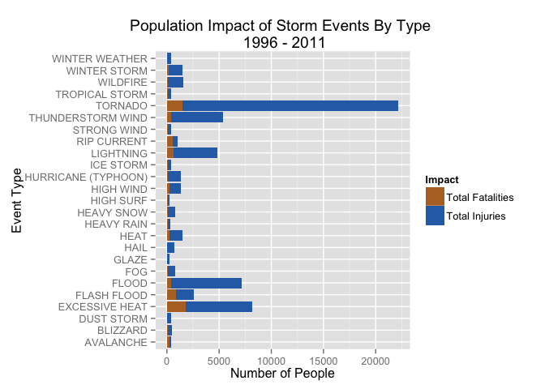
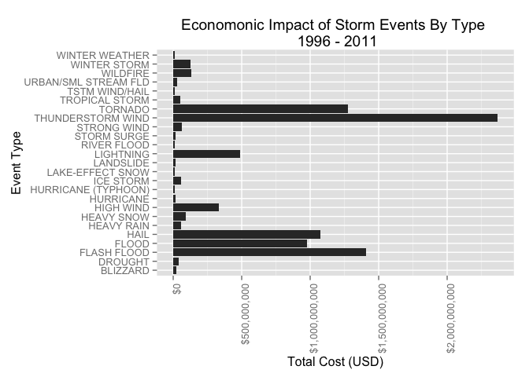

# An Analysis of the Human and Economic Costs of Storm Events, from 1996 - 2011
Casey Thomas  
March 22, 2015  

## Snyopsis

Using historical storm event data provided by the U.S. National Oceanic and Atmospheric Administration (NOAA), this analysis seeks to answer the following questions:

1. Across the United States, which types of events are most harmful with respect to population health?
2. Across the United States, which types of events have the greatest economic consequences?

The first section describes the necessary steps to obtain the data and prepare for analysis, while the second section contains analysis used to answer the above questions.

This analysis shows that tornadoes have caused far more injuries than any storm type, but excessive heat events have caused more fatalities, while thunderstorm wind events and flooding events are the biggest cause of economic damage.

## Data Processing

To preform the analysis, we must first download NOAA storm event data from 1950 - 2011. For more information about this data, see the [documentation](https://d396qusza40orc.cloudfront.net/repdata%2Fpeer2_doc%2Fpd01016005curr.pdf). 


```r
library('dplyr')
```

```
## 
## Attaching package: 'dplyr'
## 
## The following object is masked from 'package:stats':
## 
##     filter
## 
## The following objects are masked from 'package:base':
## 
##     intersect, setdiff, setequal, union
```

```r
library('ggplot2')
library('scales')
library('stringr')
library('reshape2')
library('magrittr')

setwd('~/git/data-science/RepData_PeerAssessment2/')

file_url <- 'https://d396qusza40orc.cloudfront.net/repdata%2Fdata%2FStormData.csv.bz2'
file_name <- 'repdata-data-StormData.csv.bz2'

download.file(file_url, file_name, method='curl')

data <- read.csv(bzfile(file_name), as.is = TRUE)
```

After we read in the data, we must clean it up and prepare it for analysis.

To make our operations faster, we keep only the fields we need for the analysis: those related to the event type, date, and human and economic impacts.


```r
data_trimmed <- data %>%
  select(BGN_DATE, EVTYPE, FATALITIES, INJURIES, PROPDMG, PROPDMGEXP, CROPDMG, CROPDMGEXP)
```

According to NOAA, there are three eras of [event type reporting methodologies](http://www.ncdc.noaa.gov/stormevents/details.jsp?type=eventtype). To make sure we are only comparing data that was reported in the same way, we'll only analyze data from 1996 and forward; when event types were encoded in 48 distinct categories.


```r
data_trimmed$EVENTDATE <- as.POSIXct(data_trimmed$BGN_DATE, format='%m/%d/%Y')
data_trimmed_1996_2011 <- filter(data_trimmed, EVENTDATE >= '1996-01-01')
```

Since we'll be doing an economic cost analysis of the storm events, we also have to convert the property and crop damage columns to appropriate U.S. dollar value.


```r
convert_to_usd <- function(dmg, multiplier) {
  cost <- 0.00
  
  if (multiplier == 'K') {
    cost <- dmg * 1000
  } else if (multipler == 'M') {
    cost <- dmg * 1000000  
  } else if (multipler == 'B') {
    cost <- dmg * 1000000000  
  }
  
  cost
}

data_trimmed_1996_2011_w_costs <- data_trimmed_1996_2011 %>%
  mutate(PROPCOST = convert_to_usd(PROPDMG, PROPDMGEXP),
         CROPCOST = convert_to_usd(CROPDMG, CROPDMGEXP))
```

```
## Warning in if (multiplier == "K") {: the condition has length > 1 and only
## the first element will be used
```

```
## Warning in if (multiplier == "K") {: the condition has length > 1 and only
## the first element will be used
```

And despite using only the data collected under the most recent methodology, there are still event type categories that must be corrected. The correct types are listed in Section 2.1.1 of the data documentation.


```r
attach(data_trimmed_1996_2011_w_costs)
data_trimmed_1996_2011_w_costs$EVTYPE[EVTYPE == 'TSTM WIND'] <- 'THUNDERSTORM WIND'
data_trimmed_1996_2011_w_costs$EVTYPE[EVTYPE == 'HURRICANE/TYPHOON'] <- 'HURRICANE (TYPHOON)'
data_trimmed_1996_2011_w_costs$EVTYPE[EVTYPE == 'WILD/FOREST FIRE'] <- 'WILDFIRE'
data_trimmed_1996_2011_w_costs$EVTYPE[EVTYPE == 'RIP CURRENTS'] <- 'RIP CURRENT'
detach(data_trimmed_1996_2011_w_costs)
```

## Results

This first section of this analysis answers the question: *Across the United States, which types of events (as indicated in the EVTYPE variable) are most harmful with respect to population health?*

Tornadoes have caused far more injuries than any storm type, but excessive heat events have caused more fatalities.


```r
harmful_to_pop_by_type <- data_trimmed_1996_2011_w_costs %>%
  group_by(EVTYPE) %>%
  filter(FATALITIES > 0 | INJURIES > 0) %>%
  summarize(total_fatalities = sum(FATALITIES),
            total_injuries = sum(INJURIES)) %>%
  arrange(desc(total_injuries),
          desc(total_fatalities),
          EVTYPE)

harmful_to_pop_by_type
```

```
## Source: local data frame [135 x 3]
## 
##                 EVTYPE total_fatalities total_injuries
## 1              TORNADO             1511          20667
## 2                FLOOD              414           6758
## 3       EXCESSIVE HEAT             1797           6391
## 4    THUNDERSTORM WIND              371           5029
## 5            LIGHTNING              651           4141
## 6          FLASH FLOOD              887           1674
## 7             WILDFIRE               87           1456
## 8         WINTER STORM              191           1292
## 9  HURRICANE (TYPHOON)               64           1275
## 10                HEAT              237           1222
## ..                 ...              ...            ...
```

On the whole, tornadoes have had the biggest impact on humans and communities should make sure to be prepared for them. 


```r
harmful_to_pop_by_type %>%
  head(25) %>%
  melt(id.vars = "EVTYPE") %>%
  ggplot(aes(x = EVTYPE, y = value, fill = variable)) +
    ggtitle("Population Impact of Storm Events By Type \n 1996 - 2011") +
    labs(x = "Event Type", y = "Number of People") +
    scale_fill_manual(values=c("#B5722B", "#2B6EB5"),
                       name="Impact",
                       breaks=c("total_fatalities", "total_injuries"),
                       labels=c("Total Fatalities", "Total Injuries")) +
    geom_bar(stat = "Identity") +
    coord_flip()
```

 

Looking at the frequency of events that caused harm, lightning and thunderstorm wind events happen more often and also casue a significant amount of harm; meaning these types of events should be planned for as well.


```r
most_frequent <- data_trimmed_1996_2011_w_costs %>%
  group_by(EVTYPE) %>%
  filter(FATALITIES > 0 | INJURIES > 0) %>%
  summarize(count = n(),
            total_impact = sum(INJURIES + FATALITIES)) %>%
  filter(count >= 100) %>%
  arrange(desc(count))

most_frequent
```

```
## Source: local data frame [16 x 3]
## 
##               EVTYPE count total_impact
## 1          LIGHTNING  2649         4792
## 2  THUNDERSTORM WIND  2284         5400
## 3            TORNADO  1968        22178
## 4        FLASH FLOOD   847         2561
## 5     EXCESSIVE HEAT   665         8188
## 6        RIP CURRENT   599         1045
## 7          HIGH WIND   512         1318
## 8              FLOOD   372         7172
## 9           WILDFIRE   331         1543
## 10         AVALANCHE   237          379
## 11       STRONG WIND   215          381
## 12      WINTER STORM   215         1483
## 13              HAIL   170          720
## 14              HEAT   160         1459
## 15        HEAVY SNOW   151          805
## 16        HEAVY RAIN   115          324
```

The next section of this analysis answers the question: *Across the United States, which types of events have the greatest economic consequences?*

The below analysis shows that thunderstorm wind events cause the most economic damage. However, if you combine both types of flooding events (floods and flash floods), you will see that they cause more damage. 


```r
econ_damage_by_type <- data_trimmed_1996_2011_w_costs %>%
  filter(PROPCOST > 0 | CROPCOST > 0) %>%
  group_by(EVTYPE) %>%
  summarize(total_propcost = sum(PROPCOST),
            total_cropcost = sum(CROPCOST)) %>%
  mutate(total_cost = total_propcost + total_cropcost) %>%
  arrange(desc(total_cost), EVTYPE)

econ_damage_by_type
```

```
## Source: local data frame [183 x 4]
## 
##               EVTYPE total_propcost total_cropcost total_cost
## 1  THUNDERSTORM WIND     2192964270      175773600 2368737870
## 2        FLASH FLOOD     1247562540      161066710 1408629250
## 3            TORNADO     1187878230       90128500 1278006730
## 4               HAIL      575317280      498339120 1073656400
## 5              FLOOD      824936710      151826180  976762890
## 6          LIGHTNING      488561850        1903440  490465290
## 7          HIGH WIND      315098060       17268210  332366270
## 8           WILDFIRE      122315280        8549230  130864510
## 9       WINTER STORM      126910490        1963990  128874480
## 10        HEAVY SNOW       89393110        1591700   90984810
## ..               ...            ...            ...        ...
```

The below bar chart shows the top 25 event types that cause the most damage.


```r
econ_damage_by_type %>%
  head(25) %>%
  ggplot(aes(x = EVTYPE, y = total_cost)) +
    geom_bar(stat = "Identity") +
    ggtitle("Economonic Impact of Storm Events By Type \n 1996 - 2011") +
    labs(x = "Event Type", y = "Total Cost (USD)") +
    scale_y_continuous(labels = dollar) +
    theme(axis.text.x = element_text(angle = 90, hjust = 1)) + 
    coord_flip()
```

 
